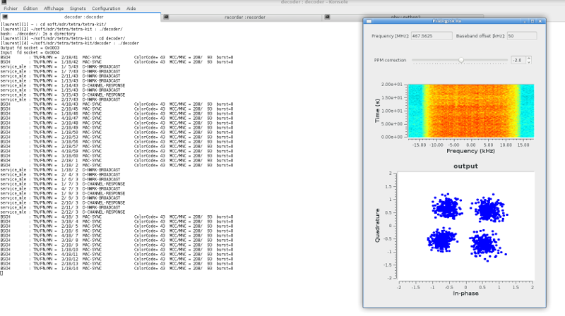

# Tetra-kit

TETRA downlink decoder/recorder kit



Generalities
============

This project aim is to provide an extensible TETRA downlink receiver kit for RTL-SDR dongle with following ideas:
- Stays as close as possible to TETRA specification layers defined in `ETSI EN 300 392-2 v3.4.1
(2010-08)`
- Transmit downlink informations (including speech frames) in Json plain text format to be recorded or analyzed
by an external program
- Reassociate speech frames with a simple method based on associated `caller id` and `usage marker` (save messages transmitted simultaneously in separated files)

The decoder implements a soft synchronizer allowing missing frames (50 bursts) before loosing synchronization.

Workflow
========

The decoder get physical layer bits from gnuradio PI/4 DQPSK receiver and transmit TETRA downlink
informations in Json format to be analyzed and recorded.

Speech frames are compressed with `zlib` and coded in `Base64` to be transmitted in Json text.

The 3 parts are linked with UDP sockets:

    Physical (TX on UDP port 42000) -> receiver (TX on UDP port 42100) -> recorder

Physical layer
-------------

The physical `PI/4 DQPSK` gnuradio receiver is inspired from [Tim's tetra-toolkit](https://github.com/Tim---/tetra-toolkit).
It works fine with RTL-SDR dongles at 2Mbps.
Results are much better than with HackRF which is more noisy.

Decoder
-------

The decoder role is to interpret and reconstruct TETRA packets and transmit it in Json format
for recording and analysis. Only a few fields are transmitted for now, but using Json, it can
be extensed very easily.
It implements partially the downlink `MAC`, `LLC`, `MLE`, `CMCE` and `UPLANE` layers.

Recorder
--------

The recorder maintain a store of associated `caller id`, suscriber identities `ssi` and `usage marker` by interpreting Json text received. It also handles the `D-RELEASE` to remove a given `caller id` from list.

The speech `.out` files are stored in the `recorder/out` folder and can be processed with TETRA codec to recover speech. The script is provided in `recoder/wav` folder to convert all `.out` files to `.wav`

```sh
$ cd recorder/wav/
$ ./out2wav.sh
```

Listen voice messages
---------------------
`tetra-kit-player` has been developped by @dextor to play voice messages recorded by `tetra-kit` directly within your web browser.

Get [tetra-kit-player](https://github.com/sonictruth/tetra-kit-player).


Build
=====

    Note: don't forget to run `make clean` and rebuild the decoder and recorder when the repositery is updated

Prerequisites:
* gnuradio >= v3.7.14 and gnuradio-companion with rtl-sdr (works also with GnuRadio 3.7.11)
* gcc
* rapidjson v1.1.0 (packages available in Ubuntu, Debian/Devuan and Slackware from SlackBuild.org)
* zlib v1.2.11 (other versions may work)
* sox for audio processing
* ncurses (optional interface for the recorder. If you don't want it, set `#undef WITH_NCURSES` in file `recorder/window.h`)
* node.js for `tetra-kit-player`

Build project
```sh
$ ./build.sh
or
$ sh build.sh
```

Physical layer
```sh
$ cd phy
$ gnuradio-companion pi4dqpsk_rx.grc
```

The internal speech codec is now used by default, `.raw` output files are generated
directly in `recorder/raw/` folder (`-a` option not required anymore).

The script `raw2wav.sh` is used to convert it to wav file.


Anyway, if you still want to use the external ETSI speech codecs
with the script `out2wav.sh`, you can use `recorder` with `-x` flag.

Usage
=====

Open 3 shells in the 3 folders:

* In recorder/ run `./recorder`

```sh
Usage: recorder [OPTIONS]

Options:
  -x don't process raw speech output with internal codec
  -r <UDP socket> receiving Json data from decoder [default port is 42100]
  -i <file> replay data from Json text file instead of UDP
  -o <file> to record Json data in different text file [default file name is 'log.txt'] (can be replayed with -i option)
  -l <ncurses line length> maximum characters printed on a report line
  -n <maximum lines in ssi window> ssi window will wrap when max. lines are printed
  -h print this help
```

When using the `-a` option (generating the raw files in `recorder/raw` folder), you can listen
voice in almost realtime thanks to the scripts provided by @orestescaminha:

```sh
$ cd recoder/raw
$ ./raw2play.sh
```

* In decoder/ run `./decoder`

```sh
Usage: decoder [OPTIONS]

Options:
  -r <UDP socket> receiving from phy [default port is 42000]
  -t <UDP socket> sending Json data [default port is 42100]
  -i <file> replay data from binary file instead of UDP
  -o <file> record data to binary file (can be replayed with -i option)
  -d <level> print debug information
  -f keep fill bits
  -h print this help
```

* In phy/ run your flowgraph from gnuradio-companion and tunes the frequency (and eventually the baseband offset which may be positive or negative)

Then you should see frames in `decoder`.
You will see less data in `recorder` but it maintains all received frames into the file `log.txt`.
Notice that this file may become big since it is never overwritten between sessions.

# Submitting bugs

When you find a bug, it is very important to record the incoming bits so I can check what's going on.
This is done with `./decoder -o out.bits` command.
You can zip and attach the `out.bits` file to the issue, it is very useful.

Typical debug session is:
1. you have some bits from `./decoder -o out.bits`
2. in folder recorder remove file `log.txt`
3. start `./recorder`
4. in folder decoder, replay your bits file with `./decoder -i out.bits`
5. go back to recorder folder and read the `log.txt` file

Note that the `out.bits` file can be read by sq5bpf program `tetra-rx out.bits`.

# `tetra-kit-player` from @dextor to listen voice in web browser

- get [tetra-kit-player](https://github.com/sonictruth/tetra-kit-player) courtesy @dextor
- copy it in the `parent folder` of tetra-kit (ie. the folder containing tetra-kit)
- in `tetra-kit-player` folder, build the npm package `npm -i`
- set the user data in `.env` file (login, password, link to recorder output folder, etc...)
- in `tetra-kit` folder, as usual, start the `phy` the `decoder` and `recorder -a` to get raw audio output
- in `tetra-kit-player` folder, start the npm server `npm start`
- you now can listen/record audio in your web browser at address `http://localhost:8443`
- enjoy !

# Previous work

This kit has been done thanks to the work of:
* [osmo-tetra](https://git.osmocom.org/osmo-tetra/)
* [sq5bpf osmo-tetra](https://github.com/sq5bpf/osmo-tetra-sq5bpf)
* [sq5bpf telive](https://github.com/sq5bpf/telive)
* [brmlab.cz](https://brmlab.cz/project/sdr/tetra)
* [tetra-listener](https://jenda.hrach.eu/gitweb/?p=tetra-listener;a=summary)

Viterbi codec
* [Min Xu Viterbi codec](https://github.com/xukmin/viterbi)

Base64 decoder
* [Joe DF base64.c](https://github.com/joedf/base64.c)

FEC correction [NEW]
* Lollo Gollo (see issue #21)

# To be done

* LLC reassembly of segmented TL-SDU
* SDS tries to decode unknown protocols with 8 bits alphabets
* UDP packet size is limited to 2048 bytes, may be small for all Json text informations
